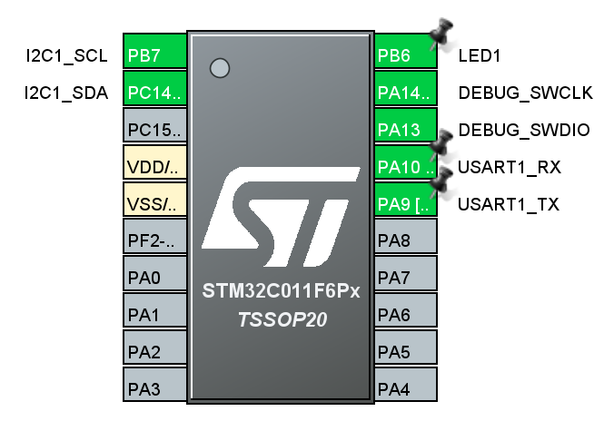
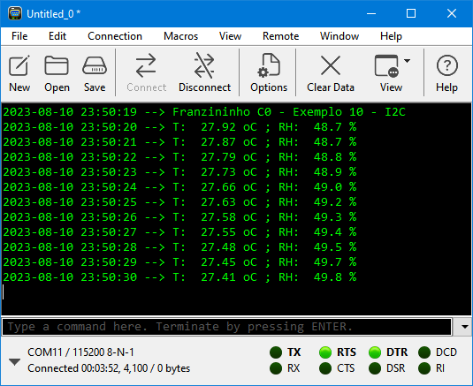
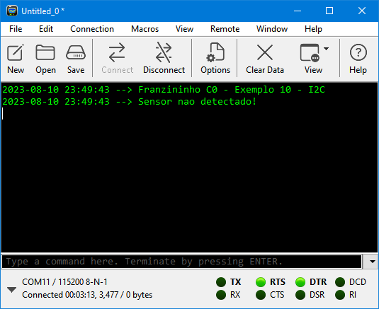

## Exemplo I2C 
  
Realiza leitura de temperatura e umidade relativa com o sensor HTU21D.  
Após receber e converter os dados, envia pela serial.  
Durante inicialização, caso haja falha na comunicação com o sensor, apresenta mensagem de erro e fica travado aguardando reset.  

Foram configurados os seguintes periféricos:  
- GPIO:
	- PB6 - Output (LED1);
- I2C:
	- I2C1, 400 kHz
	- PB7 - I2C1 SCL;
	- PC14 - I2C1 SDA
- USART1:
	- PA9 - TX;
	- PA10 - RX 
- Clock do sistema: interno 48 MHz  
  
  
  
## Software  
  
STM32CubeIDE Version: 1.13.0

## Teste  
  
  
  
  
  
Teste com sensor desconectado:  
  