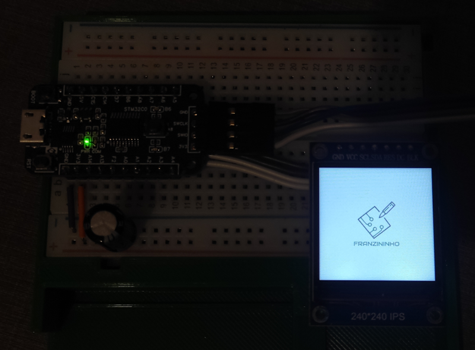
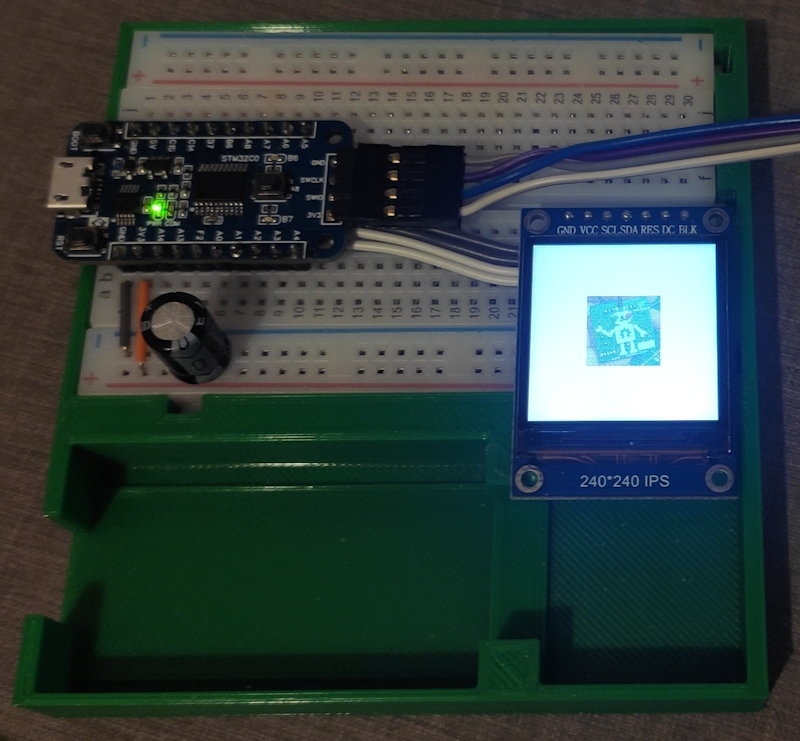
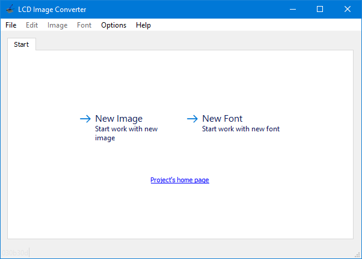
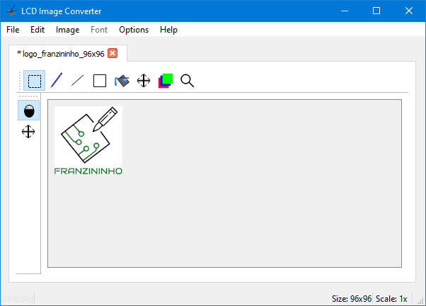
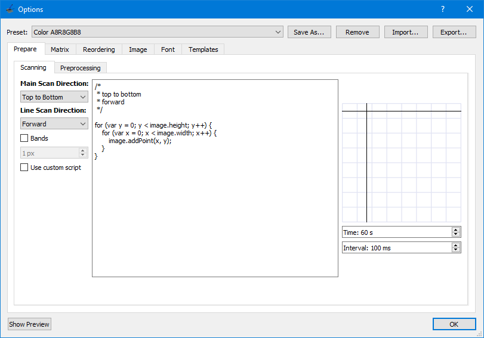
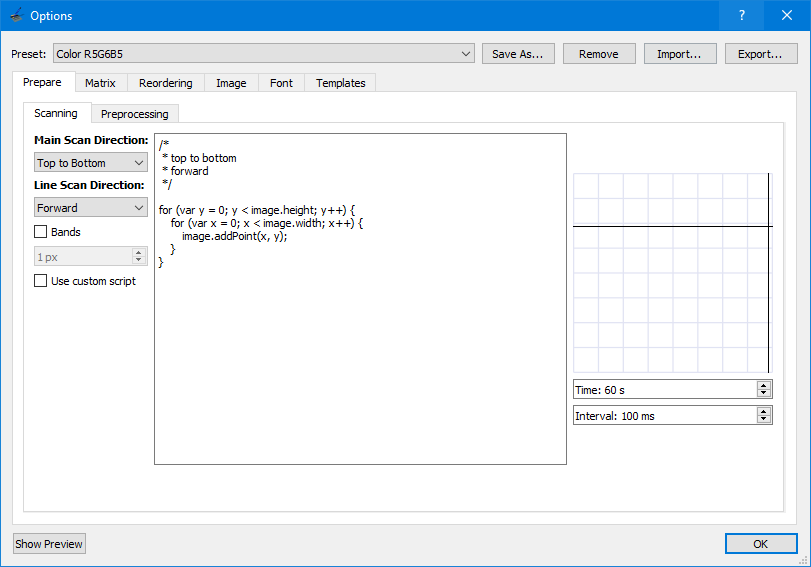
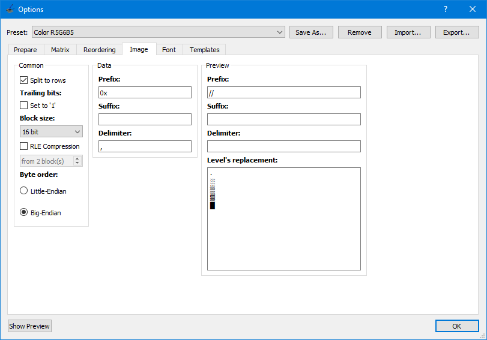
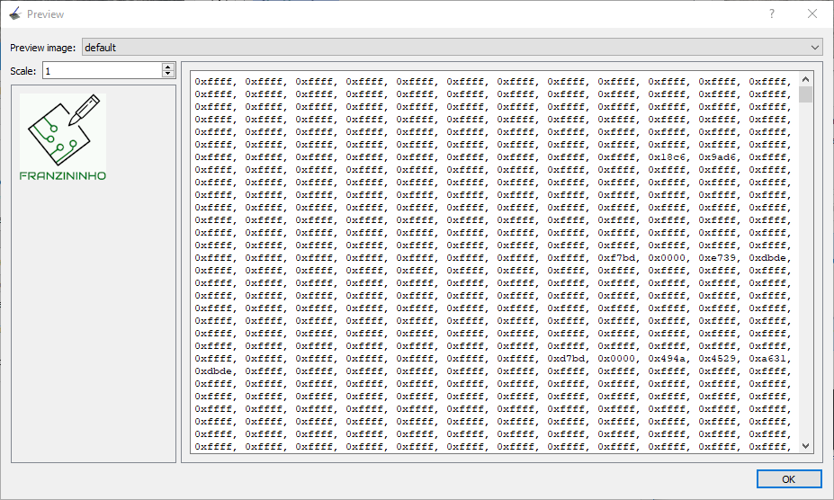

## Exemplo SPI  
  
Realiza escrita num display LCD colorido (16 bits, RGB 565) 240x240 pixels utilizando o controlador ST7789.    
Devido à memória Flash reduzida na linha C0, neste exemplo coube apenas 1 bitmap de 96x96 pixels.  

No código há 2 imagens convertidas, mas apenas 1 é utilizada, conforme comando abaixo:

``` cpp
    ST7789_DrawImage((240-logo_w)/2, (240-logo_w)/2, logo_w, logo_w, logo_franzininho);
```
  
Foram configurados os seguintes periféricos:  
- GPIO:
	- PA3 - Output (ST7899_RST);
	- PA4 - Output (ST7899_DC);
	- PB6 - Output (LED1);
- SPI:
	- SPI1, 12 MHz;
	- PA7 - SPI1_MOSI;
	- PA8 - SPI1_MISO;
- Clock do sistema: interno 48 MHz  
  
  
  
## Software  
  
STM32CubeIDE Version: 1.13.1

## Teste  
  
  

  

  

  

## Referências utilizadas

### Biblioteca para o controlador ST7789

Foi utilizada a biblioteca [ST7789-STM32](https://github.com/Floyd-Fish/ST7789-STM32) elaborada por [FloydFish](https://github.com/Floyd-Fish).  
É importante manter a nomenclatura dos pinos de controle consistente com a biblioteca, para que não seja necessário alterar o código no arquivo ST7789.h.  

### Ferramenta para gerar código a partir das imagens

Foi utilizado o aplicativo [lcd-image-converter](https://sourceforge.net/projects/lcd-image-converter/) para gerar o vetor para as imagens incluídas neste exemplo.  

A configuração utilizada foi a seguinte:    
- Abrir o aplicativo e selecionar File -> Open...  
  
- Selecionar a imagem desejada  
  
- Selecionar Options -> Conversion...  
  
- Selecionar o Preset Color R5G6B5  
  
- Na aba Image, selecionar Block size 16 bit e Byte order Big-Endian  
  
- Finalmente, selecionar Show Preview e copiar o código gerado, que deve ser inserido como dados de um vetor no código principal.  
  
