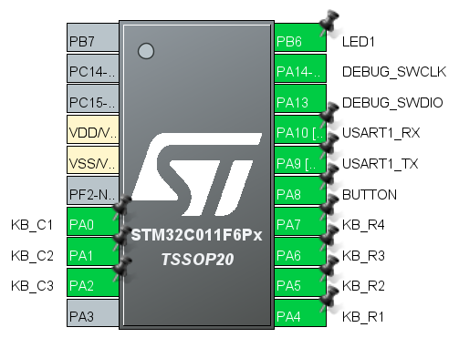
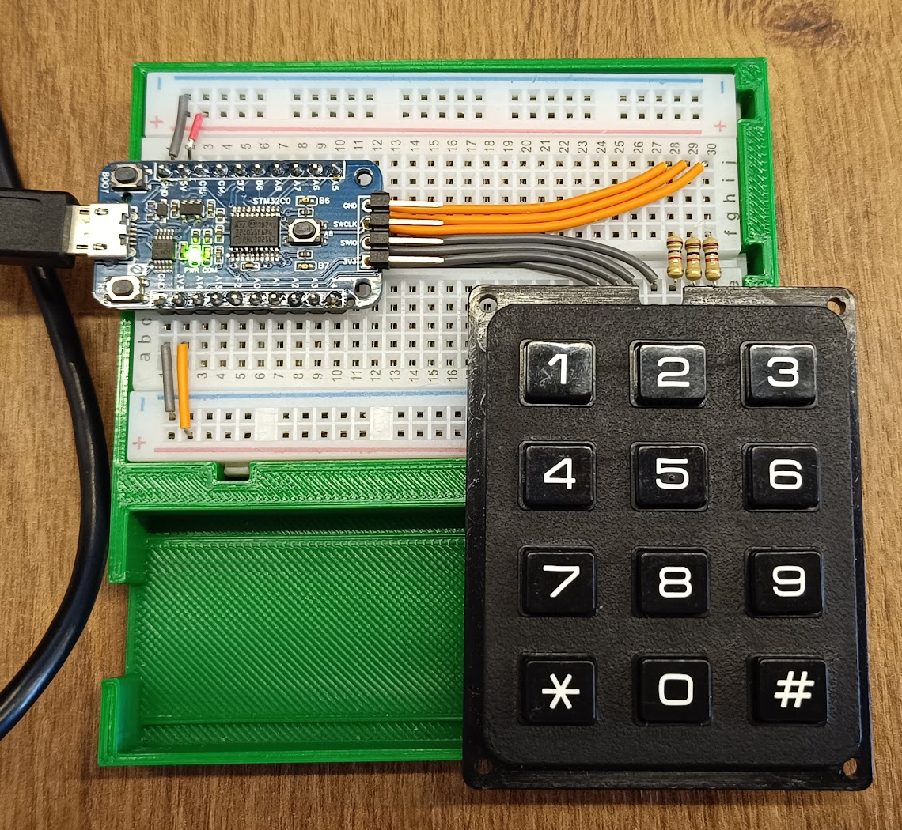

## Exemplo Teclado Matricial   
  
Realiza leitura de um teclado matricial e do botão na placa.  
A varredura da matriz é feita com pinos de saída para 3 colunas e pinos de entrada para 4 colunas.  
Ao pressionar uma telca ou botão, o MCU detecta a interrupção nos pinos de entrada e realiza a varredura das teclas, 
realizando também a rotina de debounce demonstrada no exemplo 05.  
  
Ligação do teclado:

``` cpp
	// 
	//	  C   C   C 
	//	  1   2   3 
	//	┌───┬───┬───┐ 
	//	│ 1 │ 2 │ 3 │ R1 
	//	├───┼───┼───┤ 
	//	│ 4 │ 5 │ 6 │ R2 
	//	├───┼───┼───┤ 
	//	│ 7 │ 8 │ 9 │ R3 
	//	├───┼───┼───┤ 
	//	│ * │ 0 │ # │ R4 
	//	└───┴───┴───┘ 
	// 
```
  
Foram configurados os seguintes periféricos:  
- GPIO:
	- PA0 - Output (KB_C1)
	- PA1 - Output (KB_C2)
	- PA2 - Output (KB_C3)
	- PA4 - Input - External Interrupt EXTI (KB_R1)
	- PA5 - Input - External Interrupt EXTI (KB_R2)
	- PA6 - Input - External Interrupt EXTI (KB_R3)
	- PA7 - Input - External Interrupt EXTI (KB_R4)
	- PA8 - Input - External Interrupt EXTI (BUTTON)
	- PB6 - Output (LED1)  
- USART:
	- 115200 bps, 8N1 
	- PA9 - USART1 TX
	- PA10 - USART1 RX 
- Clock do sistema: interno 48 MHz  
  
  
  
## Software  
  
STM32CubeIDE Version: 1.13.1

## Teste  
  
Montagem:  
  

Pressionando teclas:  
  

Resultado no terminal:   
  
