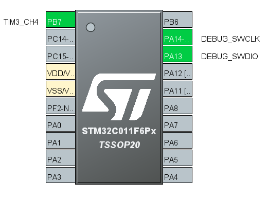
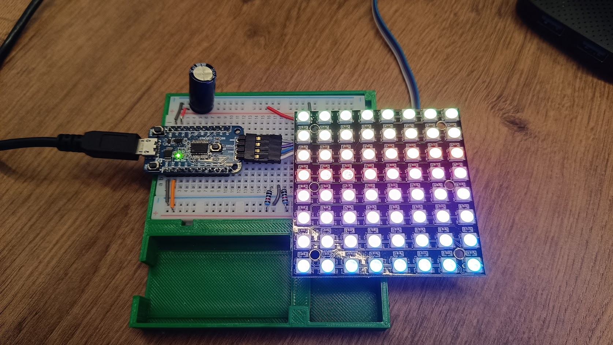

## Exemplo Matriz de LEDs
  
Realiza acionamento de uma matriz de LEDs "endereçáveis" WS2812B 64x64.  
O acionamento da matriz é feito utilizando um canal de PWM com DMA, sendo que a largura de cada pulso é obtida de uma posição do vetor de dados enviado por DMA da memória ao periférico (PWM).  
  
Foram configurados os seguintes periféricos:  
- TIMER3:
	- CH4 - Geração de PWM (PB7)
- Clock do sistema: interno 48 MHz  
  
  
  
## Software  
  
STM32CubeIDE Version: 1.13.2

## Teste  
  
  
  
  
